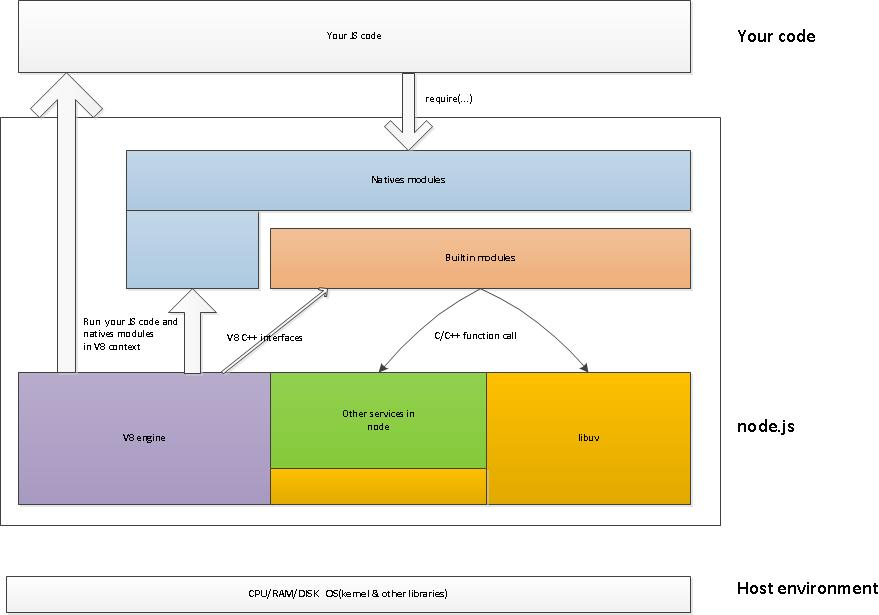

### Node入门
### Node简介
Node.js基于Google的JavaScript运行时引擎V8, 主要用于搭建响应速度快、方便扩展的服务器Web应用。Node只是JavaScript运行在服务端的环境，对V8引擎进行了完美封装，保证V8引擎在非浏览器环境下运行的更好。
### 为什么使用Node?
场景: 假设正在开发一个广告器，每分钟需要发布几百万条的广告。
这种情况下Node的非阻塞I/O将是一个高效的解决方案，因为服务器能最大限度的地利用到所有的I/O资源。Node.js框架基于事件驱动、非阻塞I/O模型，因而得以轻量和高效，非常适合在分布式终端上运行数据密集型的实时应用。

### Node的主要特性
Node的主要特性是它的标准类库、模块系统以及npm(包管理系统).实际上Node最强大的是它的标准类库，主要由二进制类库以及核心模块组成，二进制类库包括libuv，它为网络以及文件系统提供了快速轮循以及非阻塞的I/O。同时还有http类库等。大体如图：

当我们发起请求时，请求自上而下，穿越native modules，通过builtin modules将请求传送至v8，libuv和其他辅助服务，请求结束，则从下回溯至上，最终调用我们的回调函数。

### Node的核心模块

* Events (Stream, 网络，文件系统统统都是继承自这个模块)
node的events模块只提供了一个EventEmitter类，这个类实现了node异步事件驱动架构的基本模式--观察者模式，提供了绑定事件和触发事件等事件监听器模式一般都会提供的API：
```
    const EventEmitter = require('events')
    
    class MyEmitter extends EventEmitter {}
    const myEmitter = new MyEmitter()
    
    function callback() {
        console.log('触发了event事件！')
    }
    myEmitter.on('event', callback)
    myEmitter.emit('event')
    myEmitter.removeListener('event', callback);
```
只要继承EventEmitter类就可以拥有事件、触发事件等，所有能触发事件的对象都是 EventEmitter 类的实例.

* Stream (高可扩展性I/O的基础)
Stream继承于EventEmitter，能被用来在不可预测的输入下创建数据，如网络连接，网络传输速度取决于用户正在做什么。

* fs (用于对系统文件及目录进行读写操作)

* http和net网络模块
net模块是同样是nodejs的核心模块。在http模块概览里提到，http.Server继承了net.Server，此外，http客户端与http服务端的通信均依赖于socket(net.Socket).

* 其他模块

如process，可以把数据传入或传出标准的I/O流(stdout、stdin)，以及util模块，提供继承inherits和inspect等方法。

Node的缺陷：
(1) 单线程，单进程，只支持单核CPU，不能充分利用多核CPU服务器
(2) 一旦进程奔溃，整个web服务器奔溃
(3) 不适合做复杂度较高的计算

Node的优势：
(1) 采用事件驱动、异步编程，为网络服务而设计
(2) Node.js非阻塞模式的IO处理给Node.js带来在相对低系统资源耗用下的高性能与出众的负载能力，非常适合用作依赖其它IO资源的中间层服务
(3) Node.js轻量高效，可以认为是数据密集型分布式部署环境下的实时应用系统的完美解决方案

Node非常适合如下情况：在响应客户端之前，您预计可能有很高的流量，但所需的服务器端逻辑和处理不一定很多。